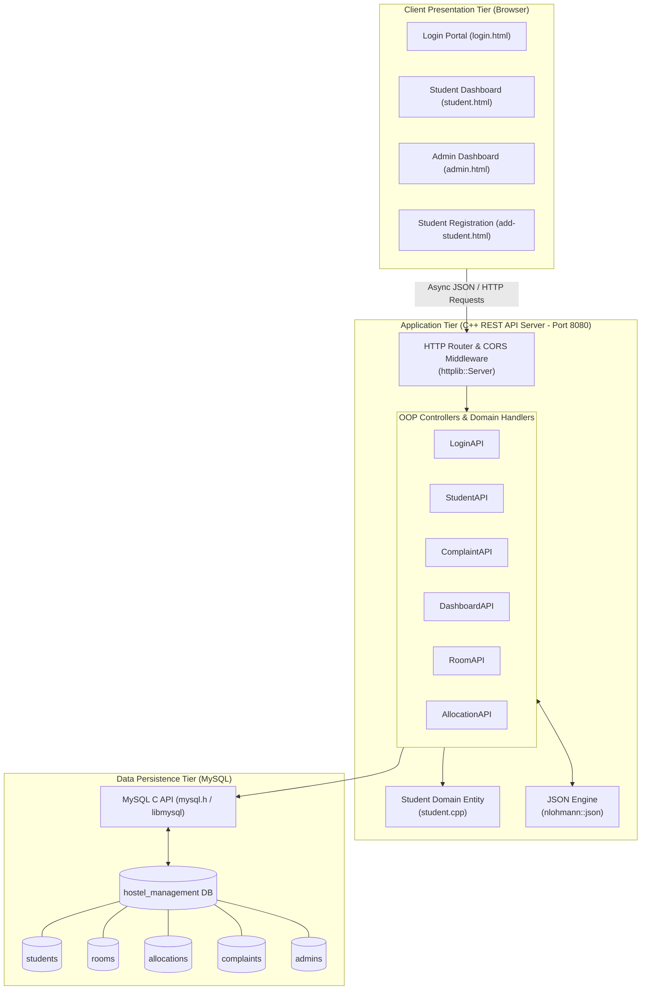

# 🏗️ HostelOS Architecture Diagram

```mermaid
graph TD
    subgraph Client ["Client Presentation Tier (Browser)"]
        UI_Login["Login Portal (login.html)"]
        UI_Student["Student Dashboard (student.html)"]
        UI_Admin["Admin Dashboard (admin.html)"]
        UI_AddStudent["Student Registration (add-student.html)"]
    end

    subgraph Backend ["Application Tier (C++ REST API Server - Port 8080)"]
        Router["HTTP Router & CORS Middleware<br/>(httplib::Server)"]
        
        subgraph OOP_Controllers ["OOP Controllers & Domain Handlers"]
            LoginAPI["LoginAPI"]
            StudentAPI["StudentAPI"]
            ComplaintAPI["ComplaintAPI"]
            DashboardAPI["DashboardAPI"]
            RoomAPI["RoomAPI"]
            AllocationAPI["AllocationAPI"]
        end

        StudentModel["Student Domain Entity<br/>(student.cpp)"]
        JSONParser["JSON Engine<br/>(nlohmann::json)"]
    end

    subgraph DataTier ["Data Persistence Tier (MySQL)"]
        MySQL_Client["MySQL C API (mysql.h / libmysql)"]
        DB[("hostel_management DB")]
        
        T_Students[("students")]
        T_Rooms[("rooms")]
        T_Allocations[("allocations")]
        T_Complaints[("complaints")]
        T_Admins[("admins")]
    end

    Client -->|Async JSON / HTTP Requests| Router
    Router --> OOP_Controllers
    OOP_Controllers <--> JSONParser
    OOP_Controllers --> StudentModel
    OOP_Controllers --> MySQL_Client
    MySQL_Client <--> DB
    DB --- T_Students
    DB --- T_Rooms
    DB --- T_Allocations
    DB --- T_Complaints
    DB --- T_Admins
```